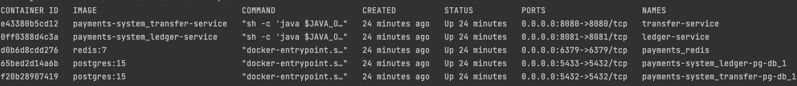

# Payments System

A FinTech-style payments system composed of two Spring Boot microservices:
* ledger-service -stores accounts and ledger entries
* transfer-service - responsible for initiating transfers


## Tools used
For building and running the application, the below tools were used

- [docker](https://www.docker.com/get-started/)
- [docker-compose](https://docs.docker.com/compose/install/)
- [Java 21](https://www.oracle.com/java/technologies/javase/jdk21-archive-downloads.html)
- [Maven](https://maven.apache.org/install.html)
- [Spring Boot](https://spring.io/)
- [Lombok](https://projectlombok.org/)
- [H2](https://www.h2database.com/html/main.html)
- [PostgreSQL](https://www.postgresql.org/)
- [SpringDoc OpenAPI](https://springdoc.org/v2/) For API documentation

## Requirements
For building and running the application, please ensure the above tools/libraries have been installed and configured


## Ledger Service
To build the application, navigate to the payments-system root folder and navigate to the ledger-service directory (`cd ledger-service`) and run the below

`./mvnw clean install`

## Transfer Service
To build the application, navigate to the payments-system root folder and navigate to the transfer-service directory (`cd transfer-service`) and run the below

`./mvnw clean install`

## How to run the application
To run the application, the payments-system root folder contains a `docker-compose.yaml` where the `ledger-service`, `transfer-db` and `redis` services have been defined.

Make sure that docker is installed on your machine and is up and running. Simply run `docker ps` on your terminal to confirm

## Verify services are up and running
While on the project's root folder on the terminal, run the below command to start the services => this will create and start the service containers

`docker-compose -f docker-compose.yaml build`

Once the above has completed, execute the below

`docker-compose -f docker-compose.yaml up -d`

Execute `docker ps` from the terminal to check if the containers are up and running, below is an example result of running docker ps:



We can check a specific container's logs by running: `docker logs <CONTAINER_ID> -f`.

* ### Verify transfer-service  is up and running

Copy the CONTAINER_ID of the `transfer-service` container service and run (based on above screenshot, the container Id is 17c67d7008f9. NOTE: It will be different for you):
```
docker logs 17c67d7008f9 -f 
```

Once it is up and running, you should see something like this in the logs

```
2025-09-08 17:13:35 INFO  [] o.s.b.w.e.tomcat.TomcatWebServer - Tomcat started on port 8080 (http) with context path '/'
2025-09-08 17:13:35 INFO  [] c.z.p.t.TransferServiceApplication - Started TransferServiceApplication in 47.102 seconds (process running for 53.433)
```

* ### Verify ledger-service  is up and running

Copy the CONTAINER_ID of the `ledger-service` container service and run (NOTE: It will be different for you):
```
docker logs 8d8197813256 -f 
```

Once it is up and running, you should see something like this in the logs

```
2025-09-08 17:13:27 INFO  [] o.s.b.a.e.web.EndpointLinksResolver - Exposing 2 endpoints beneath base path ''
2025-09-08 17:13:27 INFO  [] o.s.b.w.e.tomcat.TomcatWebServer - Tomcat started on port 8081 (http) with context path '/'
2025-09-08 17:13:27 INFO  [] c.z.p.l.LedgerServiceApplication - Started LedgerServiceApplication in 41.663 seconds (process running for 46.639)
```

## Verify redis is up and running

Copy the CONTAINER_ID of the `redis` service container and run :
```
docker logs <REDIS_CONTAINER_ID> -f 
```

Once it is up and running, you should see something like this in the logs
```
1:M 08 Sep 2025 17:12:41.284 * Creating AOF incr file appendonly.aof.1.incr.aof on server start
1:M 08 Sep 2025 17:12:41.284 * Ready to accept connections tcp
```


## Verify ledger and transfer databases are up and running 

Copy the CONTAINER_ID of the db service container service and run (based on above screenshot, the container Id is f2b718c9f14c. NOTE: It will be different for you):
```
docker logs f2b718c9f14c -f 
```

Below log message will be displayed in the docker logs, confirming DBs are up and running

```
2025-09-09 13:33:33.121 UTC [1] LOG:  database system is ready to accept connections
```

## Accessing API documentation
Once the application is up and running, the API documentation can be accessed from the links below:

* [Ledger Swagger UI](http://localhost:8080/swagger-ui/index.html)
* [Transfer Swagger UI](http://localhost:8081/swagger-ui/index.html)

## Testing the Service
Please check this document for testing
- [Testing the Service](TESTING.md)

## Stopping the service

To stop the service, run `docker-compose -f docker-compose.yaml down --volumes`

## Developer
* Kabelo Mashishi ([Kabelo.Mashishi@icloud.com](Kabelo.Mashishi@icloud.com))
